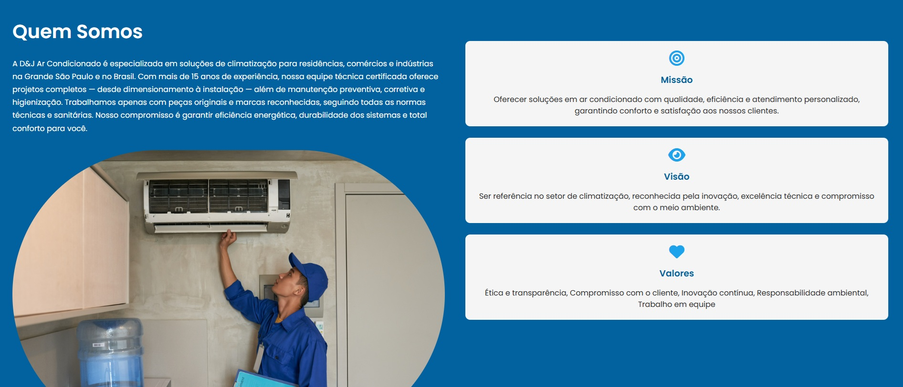
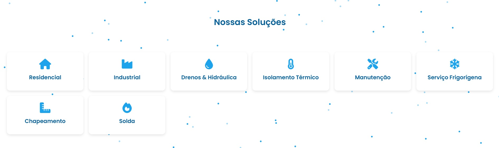
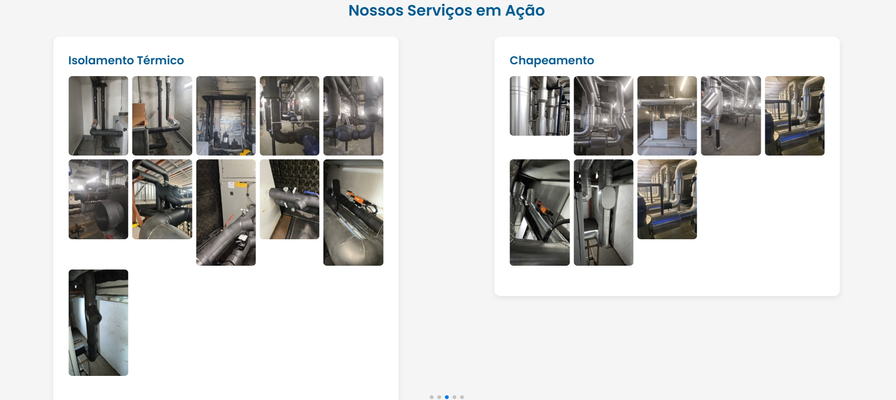
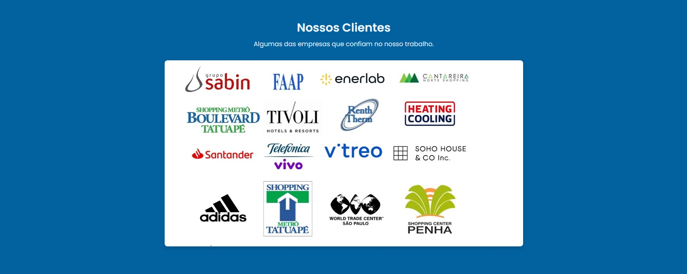
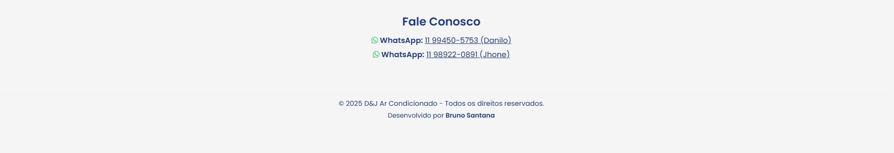

# ❄️ D&J Ar Condicionado

Website institucional desenvolvido para a empresa **D&J Ar Condicionado**, especializada em instalação, manutenção e higienização de sistemas de ar-condicionado residencial, comercial e industrial.

O site foi criado com foco em **design moderno**, **navegação fluida** e **experiência do usuário**, oferecendo informações claras sobre os serviços e facilitando o contato via WhatsApp.

---

## 🌐 Demonstração

🔗 **Ver site online:** [Aguardando publicação](#)

---

## 🚀 Tecnologias Utilizadas

- **HTML5** — Estrutura semântica e otimizada para SEO  
- **CSS3** — Estilização responsiva, efeitos visuais e animações sutis  
- **JavaScript (Vanilla)** — Funcionalidades interativas e dinâmicas  
- **Swiper.js** — Carrossel de projetos (cases)  
- **Font Awesome** — Ícones personalizados  
- **Particles.js** — Efeito visual animado com partículas leves  

---

## 💡 Recursos e Seções Principais

- **Cabeçalho fixo e responsivo** com menu hamburguer  
- **Sessão de serviços** com ícones e descrições interativas  
- **Galeria de projetos (Cases)** com carrossel animado  
- **Sessão de clientes** com marcas das empresas parceiras
- **Rodapé informativo** com contatos diretos e WhatsApp  
- **Design 100% responsivo**, adaptado para desktop e dispositivos móveis  

---

## 🧠 Objetivo do Projeto

Desenvolver uma **presença digital profissional** para a D&J Ar Condicionado, reforçando a identidade visual da marca e facilitando o contato com clientes potenciais.

---

## 👨‍💻 Desenvolvedor

**Bruno Santana**  
📧 [Contato via WhatsApp](https://wa.me/5511947169370)  
🌐 [Portfólio GitHub](https://brunoosanttana.github.io/PortifolioBS/)

---

## 🪪 Direitos Autorais

Este projeto é de propriedade intelectual de **Bruno Santana** e foi desenvolvido exclusivamente para a empresa **D&J Ar Condicionado**.  
**É expressamente proibido** copiar, redistribuir, modificar ou utilizar qualquer parte deste código-fonte, design ou conteúdo visual sem autorização prévia por escrito.

© 2025 D&J Ar Condicionado — Todos os direitos reservados.

## 📷 Preview

|  |  |  |  |  |  

